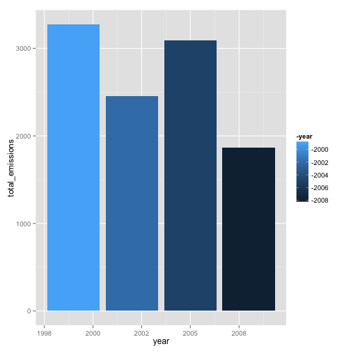

Course Project 2
========================================================


Read in the RDS files given in the assignment. Use the normalisae variable names from rattle to mkae the variable names into a standard format. Make the pollutatnt name and fips as factor variables. 


```r
classificationData <- readRDS("exdata-data-NEI_data/Source_Classification_Code.rds")
emissionsData <- readRDS("exdata-data-NEI_data/summarySCC_PM25.rds")
names(emissionsData) <- normVarNames(names(emissionsData))
```

```
## Loading required package: stringr
```

```r
names(classificationData) <- normVarNames(names(classificationData))
# emissionsData$pollutant <- factor(emissionsData$pollutant)
# emissionsData$fips <- factor(emissionsData$fips)
```


# Intro

Fine particulate matter (PM2.5) is an ambient air pollutant for which there is strong evidence that it is harmful to human health. In the United States, the Environmental Protection Agency (EPA) is tasked with setting national ambient air quality standards for fine PM and for tracking the emissions of this pollutant into the atmosphere. Approximatly every 3 years, the EPA releases its database on emissions of PM2.5. This database is known as the National Emissions Inventory (NEI). You can read more information about the NEI at the EPA National Emissions Inventory web site.

Data

The data for this assignment are available from the course web site as a single zip file:

Data for Peer Assessment [29Mb]
The zip file contains two files:

PM2.5 Emissions Data (summarySCC_PM25.rds): This file contains a data frame with all of the PM2.5 emissions data for 1999, 2002, 2005, and 2008. For each year, the table contains number of tons of PM2.5 emitted from a specific type of source for the entire year. Here are the first few rows.

- fips: A five-digit number (represented as a string) indicating the U.S. county
- SCC: The name of the source as indicated by a digit string (see source code classification table)
- Pollutant: A string indicating the pollutant
- Emissions: Amount of PM2.5 emitted, in tons
- type: The type of source (point, non-point, on-road, or non-road)
- year: The year of emissions recorded

Below I show the summary of the variables, there type and some values. I have also tbl_df from dplyr to print a lot of data to the screen


```r
str(emissionsData)
```

```
## 'data.frame':	6497651 obs. of  6 variables:
##  $ fips     : chr  "09001" "09001" "09001" "09001" ...
##  $ scc      : chr  "10100401" "10100404" "10100501" "10200401" ...
##  $ pollutant: chr  "PM25-PRI" "PM25-PRI" "PM25-PRI" "PM25-PRI" ...
##  $ emissions: num  15.714 234.178 0.128 2.036 0.388 ...
##  $ type     : chr  "POINT" "POINT" "POINT" "POINT" ...
##  $ year     : int  1999 1999 1999 1999 1999 1999 1999 1999 1999 1999 ...
```

```r
emissionsData <- tbl_df(emissionsData)
str(classificationData)
```

```
## 'data.frame':	11717 obs. of  15 variables:
##  $ scc                : Factor w/ 11717 levels "10100101","10100102",..: 1 2 3 4 5 6 7 8 9 10 ...
##  $ data_category      : Factor w/ 6 levels "Biogenic","Event",..: 6 6 6 6 6 6 6 6 6 6 ...
##  $ short_name         : Factor w/ 11238 levels "","2,4-D Salts and Esters Prod /Process Vents, 2,4-D Recovery: Filtration",..: 3283 3284 3293 3291 3290 3294 3295 3296 3292 3289 ...
##  $ ei_sector          : Factor w/ 59 levels "Agriculture - Crops & Livestock Dust",..: 18 18 18 18 18 18 18 18 18 18 ...
##  $ option_group       : Factor w/ 25 levels "","C/I Kerosene",..: 1 1 1 1 1 1 1 1 1 1 ...
##  $ option_set         : Factor w/ 18 levels "","A","B","B1A",..: 1 1 1 1 1 1 1 1 1 1 ...
##  $ scc_level_one      : Factor w/ 17 levels "Brick Kilns",..: 3 3 3 3 3 3 3 3 3 3 ...
##  $ scc_level_two      : Factor w/ 146 levels "","Agricultural Chemicals Production",..: 32 32 32 32 32 32 32 32 32 32 ...
##  $ scc_level_three    : Factor w/ 1061 levels "","100% Biosolids (e.g., sewage sludge, manure, mixtures of these matls)",..: 88 88 156 156 156 156 156 156 156 156 ...
##  $ scc_level_four     : Factor w/ 6084 levels "","(NH4)2 SO4 Acid Bath System and Evaporator",..: 4455 5583 4466 4458 1341 5246 5584 5983 4461 776 ...
##  $ map_to             : num  NA NA NA NA NA NA NA NA NA NA ...
##  $ last_inventory_year: int  NA NA NA NA NA NA NA NA NA NA ...
##  $ created_date       : Factor w/ 57 levels "","1/27/2000 0:00:00",..: 1 1 1 1 1 1 1 1 1 1 ...
##  $ revised_date       : Factor w/ 44 levels "","1/27/2000 0:00:00",..: 1 1 1 1 1 1 1 1 1 1 ...
##  $ usage_notes        : Factor w/ 21 levels ""," ","includes bleaching towers, washer hoods, filtrate tanks, vacuum pump exhausts",..: 1 1 1 1 1 1 1 1 1 1 ...
```


## Problem 1
Have total emissions from PM2.5 decreased in the United States from 1999 to 2008? Make a plot showing the total PM2.5 emission from all sources for each of the years 1999, 2002, 2005, and 2008.

I need to subset the emissions for each level in year and sum it.


```r
totalYearwiseData <- emissionsData %.% select(pollutant, emissions, year) %.% 
    group_by(year) %.% summarise(total_emissions = sum(emissions))
totalYearwiseData <- as.data.frame(totalYearwiseData)
# totalYearwiseData$year <- factor(totalYearwiseData$year)

p1 <- ggplot(data = totalYearwiseData, aes(x = year, y = total_emissions))
p1 + geom_bar(stat = "identity", aes(fill = -year))
```

 


## Problem 2
Have total emissions from PM2.5 decreased in the Baltimore City, Maryland (fips == "24510") from 1999 to 2008?

To answer this I create a subset of the data using the 

```r
BaltimoreData <- filter(emissionsData, fips == "24510")
totalEmissionBaltimoreData <- BaltimoreData %.% group_by(year) %.% summarise(total_emissions = sum(emissions))
totalEmissionBaltimoreData <- as.data.frame(totalEmissionBaltimoreData)

p1 <- ggplot(data = totalEmissionBaltimoreData, aes(x = year, y = total_emissions))
p1 + geom_bar(stat = "identity", aes(fill = -year))
```

 


Answer: Overall yes it has decreased but there was a spike in 2005 unlike the overall trend shown in the previous bar graph

