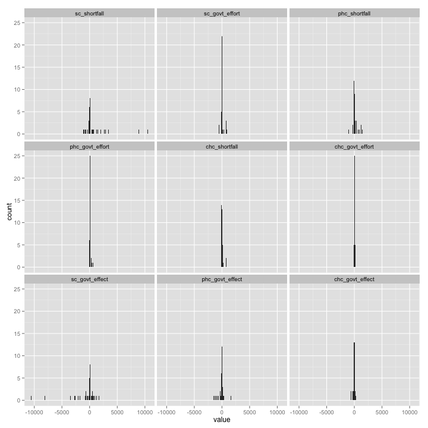

Shortfall in Health Infrastructure vs GOvernment Funding
========================================================

This is a document showing some results we found by doing EDA(Explorartory Data Analysis) on healthcare datasets from data.gov.in. 

The analysis.R script does some data wrangling and create a table with shortfall, government effort and surplus or shortfall between the two.

```r
require(ggplot2)
```

```
## Loading required package: ggplot2
```

```r
require(dplyr)
source("analysis.R")
```


You can also embed plots, for example:


```r
qplot(x = sc_shortfall, data = analysis_data, binwidth = 50) + scale_x_continuous(limits = c(-2000, 
    15000))
```

 


This shows us that in the sub centre infrastrucure. Two states are the real outliers. Lets find out which ones are they. 


```r
analysis_data %.% filter(sc_shortfall > 5000) %.% select(state_and_ut)
```

```
##      state_and_ut
## 1           Bihar
## 2   Uttar Pradesh
## 3 All India Total
```

