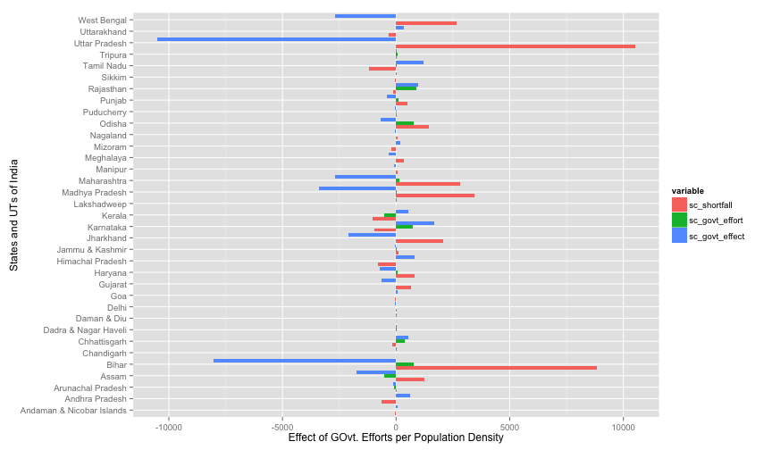

Healthcare in India
===========================
----------------------------

Introduction
------------

# Rural population.
# explain the desciption to the data


The healthcare system in India is made up of a mammoth network of Health Sub-centre (SCs), Community Health Centre(CHCs), Primary Health Centres (PHCs) spread across the country. These health centre work in tandem with each other to provide necessary healthcare facilities to their respective state citizens. 

There are several questions that we wished to explore in our quest to understand the state of healthcare in India and subsequent efforts put forth by the state governments.


----------------------------------------------

Contribution
------------
We perform exploratory data analysis on the data provided by [Open Data], an initiative of  Government of India. 

In this part of data analysis we analyse the efforts made by respective governments and restrospect their abysmal or appreciable performance. 

--------------------------------------------

Data Source
------------

We undertake this exploration to explore following two datasets. All the analysis done by us is statewise.

* [Shortfall in Health Infrastructure during Eleventh Plan](http://data.gov.in/catalog/shortfall-health-infrastructure-during-eleventh-plan#web_catalog_tabs_block_10)
* [Number of Sub-Centres, Primary Health Centres and Community Health Centres Established During Five Year Plans](http://data.gov.in/catalog/number-sub-centres-primary-health-centres-and-community-health-centres-established-during#web_catalog_tabs_block_10)


--------------------------------------------------------


Exploration
-----------
This being a exploratory analysis, I am not aware if the data has any meaning or is good enought to answer questions. I apply the exploratory graphics principles and try to select the important features of the dataset. I the resulting analysis, I combine the above mentioned datasets to analyse the efforts made by the government depending upon the situation of the healthcare requirements of that particular state.

There are several questions which we wish to contemplate from the data.
* Whether the efforts made by the respective state government are in alignment with the current scenario of healthcare in their state?
* Which state lacks in the necessary healthcare centres the most, viz-a-viz Health Sub-centres (SCs) Community Health Centre(CHCs), Primary Health Centres (PHCs)?
* Are the state governments under-investing on basic healthcare issues? 
* How have the State governments to the shortfalls in the number of health centres from their 11<sup>th</sup> plan to 12<sup>th</sup> plan?


Sub Center Shortfalls
----------------------

Evidently the Mean and Median are higher in the SC shortfall as compared to PHC and CH Centers. This means that in general the necessity of SC infrastrucure supercedes other centers. 

Some states to be worried about are *Uttar Pradesh* and *Bihar*. Which is contrary to the promises made by the health Minister at the time here in the [TOI article](http://timesofindia.indiatimes.com/city/patna/Health-sub-centre-at-every-village-in-state/articleshow/7174791.cms).There is already a surplus in Kerala and Govt. si still working in imporving the sub center infrastructre.

In general, the state goveronment is not putting enough effort in comparison to the shortfall in most of the states. 


```
##    Min. 1st Qu.  Median    Mean 3rd Qu.    Max. 
##   -1190     -89      27     861     729   10500
```


 


Primary Health Center Shortfalls
----------------------

```
##    Min. 1st Qu.  Median    Mean 3rd Qu.    Max. 
## -1010.0    -9.5     5.0   152.0   144.0  1480.0
```


The states to be worried about are **West Bengal**, **Uttar Pradesh**, **Bihar**. The state of Karnataka is seeing amazing progress in PHCs as there is a huge surplus of PHCs and Govt. is putting in the maximum effort as compared to all the other states and uts. According to this dataset based on the rural population in different states, Tamil Nadu is not doing so bad but this [article in Hindu](http://www.thehindu.com/todays-paper/tp-features/tp-downtown/article2309749.ece?css=print) does not ??depict?? that. 

 


Community Health Center Shortfalls
----------------------

```
##    Min. 1st Qu.  Median    Mean 3rd Qu.    Max. 
##   -78.0    -2.0     3.0    71.0    69.5   778.0
```


 


Conclusion and Inferences
-------------------------

(talk about the inferences from the graphs)
The outliers are Bihar, West Bengal and Uttar Pradesh to some extent. 

-------------------------------


[open data]:http://data.gov.in/
[Shortfall in Health Infrastructure during Eleventh Plan]:http://data.gov.in/catalog/shortfall-health-infrastructure-during-eleventh-plan#web_catalog_tabs_block_10
[Infant Mortality Rates in 2011]
[Shortfall in Manpower in the Phcs and Chcs]:http://data.gov.in/catalog/pharmacists-laboratory-technicians-and-nursing-staff-primary-health-centres-and-community#web_catalog_tabs_block_10
